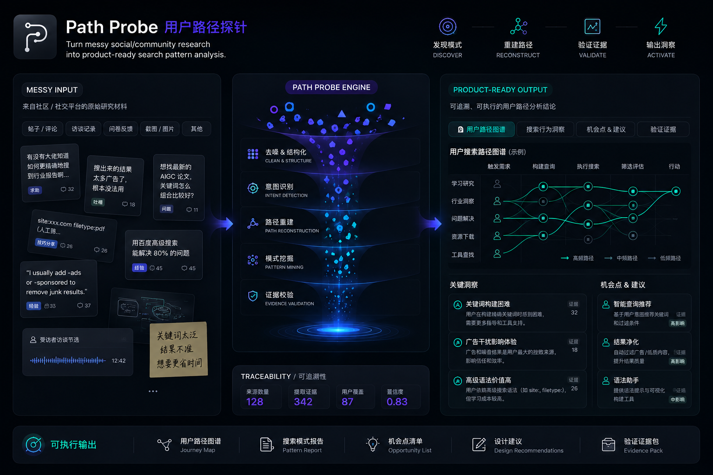

# Path Probe / 用户路径探针

Turn messy social/community research into product-ready search pattern analysis.

把脏乱的社区研究材料整理成可追溯、可执行的用户路径分析结论。

## Overview / 项目概览

**Path Probe** is a research skill for turning messy community signals into product-ready path analysis.

它不是一个“摘要器”，而是一个把混乱研究材料转成产品团队可执行结论的路径分析引擎。

It is built to help you:

- discover real search patterns
- reconstruct current replacement flows
- validate evidence strength
- translate research into product direction

它的核心不是生成漂亮画像，而是回答这些更硬的问题：

- 用户到底怎么开始搜索
- 他们信什么，不信什么
- 当前路径在哪一步断掉
- 哪个产品切入点最值得先做
- 哪些判断有证据，哪些还只是推断

## What This Skill Does / 这个 Skill 做什么

This skill helps with:

- messy research intake
- evidence structuring
- search behavior patterning
- replacement flow reconstruction
- product direction synthesis
- traceable final deliverables
- docx handoff guidance

这个 skill 适合把 Reddit、小红书、YouTube、WhatsApp、评论摘录、截图 OCR、研究笔记这类混乱输入，沉淀成产品团队能直接使用的决策结论。

It is designed for / 适用场景:

- new business opportunity discovery
- competitor or substitute flow breakdown
- search behavior analysis before product design
- research handoff to product teams

It is not designed for / 不适合:

- generic sentiment analysis
- PR monitoring
- fluffy persona generation
- unsupported strategic storytelling

## Files / 文件说明

- `SKILL.md`
  Main execution instructions.
- `assets/icon.png`
  Skill icon for docs and GitHub presentation.
- `assets/describe.png`
  Visual overview of the Path Probe pipeline and outputs.
- `example-run.md`
  End-to-end example using Canton Fair buyer material.
- `references/final-deliverable-template.md`
  Default markdown output structure.
- `references/docx-template.md`
  Shareable handoff structure for `.docx`.
- `references/traceability-guide-template.md`
  Plain-language evidence lookup instructions.
- `references/anti-patterns.md`
  Failure modes and guardrails.

## Typical Workflow / 使用流程

1. Paste messy research material into Codex.
2. Trigger this skill.
3. Let the skill normalize and audit the material.
4. Review the product-facing deliverable.
5. Export or convert the result into a `.docx` handoff if needed.

中文简版：

1. 把你收集的脏材料直接贴进来。
2. 触发 `Path Probe / 用户路径探针`。
3. 让它自动整理、做证据审计、识别路径模式。
4. 查看产品团队可执行的结论文档。
5. 需要正式交付时，再整理成 `.docx`。

## Success Standard / 成功标准

The output should let a product team answer:

- what kinds of users search differently
- what sources they trust
- where the current flow breaks
- what to build first
- what still needs more evidence

If the output mostly says "users care about trust" or "users have pain points," the run failed.
